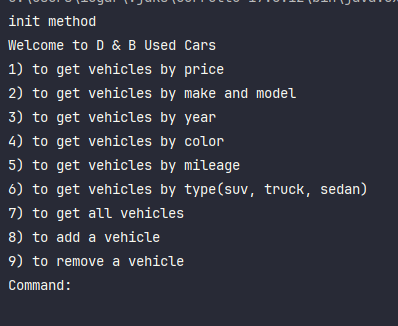
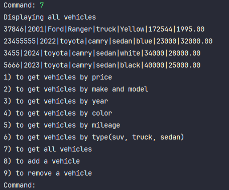
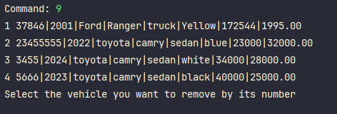
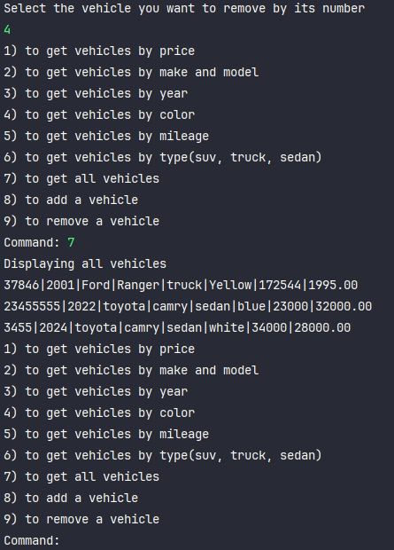
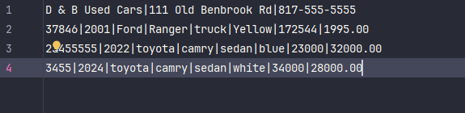

# Dealership Workshop
This is a Dealership application that allows users to view and interact with vehicles in said Dealership.
The users can view vehicles by filtering through price, year, vehicle type(suv, sedan, truck ), color, price, and mileage.
In addition, users can also add or remove vehicles. 

# Main menu Screen

# Display all vehicles 

# Vehicle removal

# Vehicles list after removal 

# Csv file after removal 
